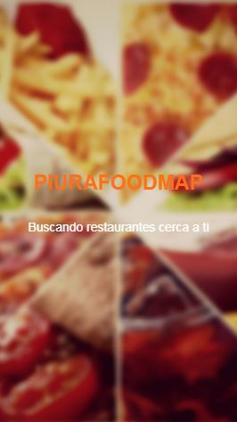
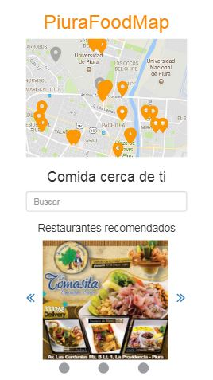
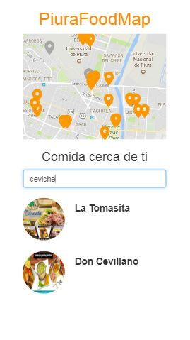
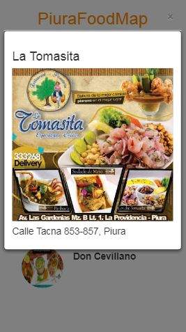

# PIURAFOODMAP

## Objetivos

- Vista splash con duración de 2 a 5 segundos que redirecciona a tu vista principal.

- En la vista principal se muestra los restaurantes recomendados "cerca de ti" junto con el input para filtrar por tipo de comida (Cevicheria, polleria).

- Ya que se hizo la elección del filtro deben mostrarse únicamente aquellos restaurantes que cumplan con la condición.

-  Al seleccionar alguno de los restaurantes, deberá mostrarse la información de este a través de un modal.

